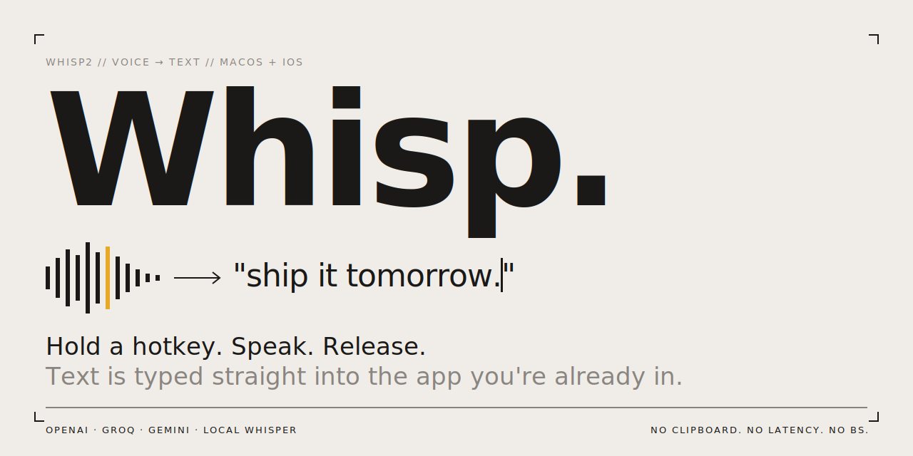

<p align="center">
  
</p>

# Whisp2

macOS menu bar app + iOS app for voice-to-text. Hold a hotkey (or press the iPhone Action Button), speak, release — transcribed text is typed directly into whatever app you're using. No clipboard. No switching windows.

Built with [Tauri 2](https://tauri.app) (Rust + React, plus a Swift Live Activity extension), targeting macOS 13+ and iOS 17+.

> ⚠️ **iOS is unofficial.** The iPhone build is for developers who want to build and run it locally via Xcode. There's no TestFlight or App Store distribution, no signed `.ipa`, no support guarantees. The macOS app is the supported product.

## Why

Wispr Flow is $15/mo. Superwhisper is $9/mo. The actual hard part — typing text into another app without using the clipboard — is a few hundred lines of `CGEvent` and AVFoundation.

Whisp is the same workflow, free, open-source, with your choice of cloud provider or fully on-device transcription. Bring your own API key (stored in the Keychain, never on disk) or run locally with Whisper GGML.

| | Whisp | Wispr Flow | Superwhisper |
|---|---|---|---|
| Price | **Free** | $15/mo | $9/mo |
| Source available | ✅ MIT | ❌ | ❌ |
| Bring-your-own API key | ✅ | ❌ | ✅ |
| 100% on-device option | ✅ Local Whisper (GGML) | ❌ | ✅ |
| iPhone Action Button + Live Activity | ✅ | ❌ | ❌ |
| Audio never stored to disk | ✅ | — | — |
| Inject text without clipboard | ✅ CGEvent Unicode | ✅ | ✅ |

## Features

- **Press-and-hold or toggle** recording mode
- **Multiple transcription providers** — OpenAI Whisper, Groq, Gemini, or fully on-device via local Whisper (GGML)
- **Direct text injection** via CGEvent Unicode posting — works in any app, including terminals
- **Floating HUD** shows recording state without interrupting focus
- **Dictionary** — define word substitutions applied after every transcription
- **History** — searchable log of past transcriptions with per-entry copy/delete
- **No clipboard** — text is injected directly, never touches your clipboard

## Requirements

**macOS:**
- macOS 13+
- Apple Silicon (aarch64)
- Three system permissions: **Accessibility**, **Input Monitoring**, **Microphone**

**iOS (developer build only — no official distribution):**
- iOS 17+
- iPhone 15 Pro or later (Action Button)
- Apple Developer account + Xcode (you build and sign it yourself)

## Installation

Download the latest `.dmg` from [Releases](https://github.com/amirsalaar/whisp2/releases), mount it, and drag **Whisp2.app** to `/Applications`.

On first launch, grant the three required permissions from the Permissions tab in Settings.

> If macOS blocks the app on first open, right-click → **Open**.

## Transcription Providers

| Provider | Requires |
|---|---|
| OpenAI Whisper | OpenAI API key |
| Groq | Groq API key |
| Gemini | Google AI API key |
| Local Whisper | GGML `.bin` model file (downloadable from Settings) |

API keys are stored in the macOS Keychain, never on disk.

## Building from Source

**Prerequisites:** Rust (stable), Node 22+, Xcode Command Line Tools.

```sh
# Install frontend deps (first time only)
make ui-install

# Full dev session with hot-reload
make dev

# Production .app bundle
make build
```

Other useful commands:

```sh
make test      # Rust unit tests
make check     # Fast type-check (no link)
make lint-rs   # Clippy
make ui-lint   # ESLint
make fmt       # rustfmt
```

## Hotkeys

Configurable from Settings. Supported keys: Right ⌘, Left ⌥, Right ⌥, Left ⌘, Right ⌃, Fn/Globe.

## Data & Privacy

- Config: `~/Library/Application Support/com.whisp2.app/config.json`
- History: `~/Library/Application Support/com.whisp2.app/history.db` (SQLite)
- Whisper models: `~/Library/Application Support/com.whisp2.app/models/`
- API keys: macOS Keychain (`com.whisp2.app`)

Audio is never stored to disk. When using cloud providers, audio is sent directly to the provider's API and discarded.

## Contributing

PRs welcome. Good places to start:

- iOS Gemini provider implementation (`src-tauri/gen/apple/Sources/whisp-rs/WhispIntent.swift`)
- Linux build target
- Dictionary UX in the settings window

See [CLAUDE.md](CLAUDE.md) for the architecture overview.

## License

[MIT](LICENSE)
